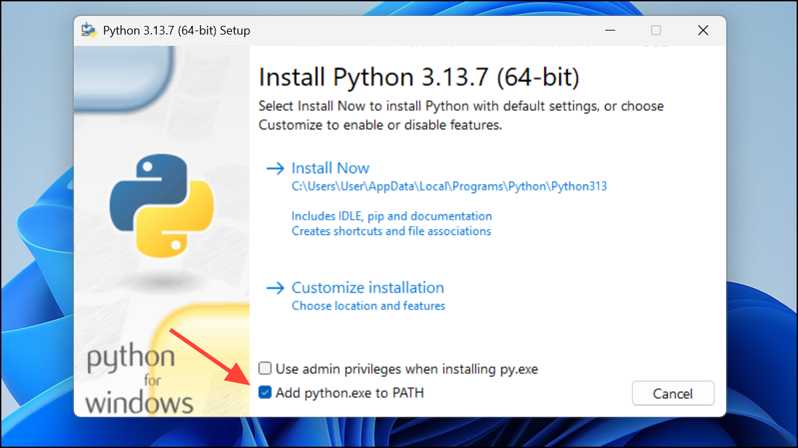
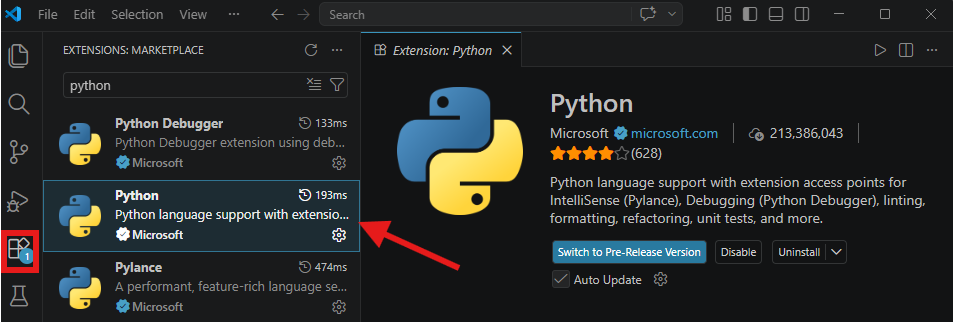

# Python Short Course

## Project Title & Summary

- This folder contains the files for a simple Python short course project.
- It is meant to help beginners open, run, and explore Python code step by step.

## Prerequisites

- This guide is written for **Windows 11**.

## Phase 1: Installing Python

- Go to the official Python download page: [https://www.python.org/downloads/windows/](https://www.python.org/downloads/windows/)
- Download the latest recommended Python version for Windows.
- Open the installer after it finishes downloading.
- **IMPORTANT: At the bottom of the installer window, check the box that says "Add python.exe to PATH" before clicking Install Now. If you skip this step, the code will not run from your computer properly.**
  
- Click **Install Now**.
- Wait for the installation to finish.
- If Windows asks for permission, click **Yes**.

## Phase 2: Installing VS Code

- Go to the official Visual Studio Code download page: [https://code.visualstudio.com/download](https://code.visualstudio.com/download)
- Download the **Windows** version.
- Open the installer.
- Keep the default options unless you have a reason to change them.
- Click through the setup steps until installation is complete.
- Open **Visual Studio Code** after it installs.

## Phase 3: Installing Extensions

- Open **Visual Studio Code**.
- Look at the left sidebar and click the **Extensions** icon.
- The Extensions icon looks like small blocks or squares.
- In the search box, type **Python**.
- Find the official **Python** extension made by **Microsoft** and click **Install**.
  
- In the search box, type **Code Runner**.
- Find the **Code Runner** extension and click **Install**.
- Wait a few moments for both extensions to finish installing.

## Phase 4: Running the Code

- In VS Code, open this project folder.
- Open any Python file you want to run.
- Look at the top-right corner of the editor window.
- Click the **Play** button.
- VS Code will run the file for you.
- If you do not see the Play button right away, click inside the file first and make sure the file is open in the editor.
